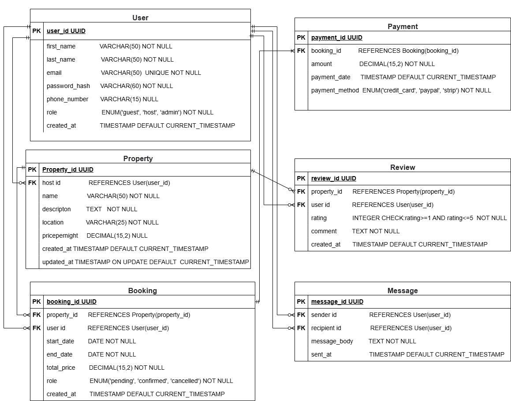

## 🧩 Entity Relationship Diagram (ERD)

**Definition:**  
ER Diagrams are visual representations of the entities (tables) in a database and their relationships. They help in understanding how data is organized and how different entities interact with each other.

### Components:

- **Entities:** Represent objects or concepts (e.g., `User`, `Payment`, `Booking`)
- **Attributes:** Properties of entities (e.g., `User ID`, `Payment Date`, `Price`)
- **Relationships:** Connections between entities (e.g., a `User` makes a `Booking`, a `Booking` includes a `Payment`)

---

## 🗃️ Database Schema Overview

### 👤 User

| Field           | Type         | Constraints               | Description            |
| --------------- | ------------ | ------------------------- | ---------------------- |
| `user_id`       | UUID         | Primary Key, NOT NULL     | Unique user identifier |
| `first_name`    | VARCHAR(50)  | NOT NULL                  | First name of the user |
| `last_name`     | VARCHAR(50)  | NOT NULL                  | Last name of the user  |
| `email`         | VARCHAR(100) | NOT NULL, UNIQUE          | User's email address   |
| `password_hash` | VARCHAR(60)  | NOT NULL                  | Hashed password        |
| `phone_number`  | VARCHAR(15)  | NULLABLE                  | Optional phone number  |
| `role`          | ENUM         | NOT NULL                  | guest, host, or admin  |
| `created_at`    | TIMESTAMP    | DEFAULT CURRENT_TIMESTAMP | User registration time |

---

### 🏠 Property

| Field           | Type          | Constraints                 | Description                |
| --------------- | ------------- | --------------------------- | -------------------------- |
| `property_id`   | UUID          | Primary Key, NOT NULL       | Unique property identifier |
| `host_id`       | UUID (FK)     | NOT NULL                    | References `User(user_id)` |
| `name`          | VARCHAR(50)   | NOT NULL                    | Property name              |
| `description`   | TEXT          | NOT NULL                    | Property description       |
| `location`      | VARCHAR(50)   | NOT NULL                    | Property location          |
| `pricepernight` | DECIMAL(10,2) | NOT NULL                    | Nightly rate               |
| `created_at`    | TIMESTAMP     | DEFAULT CURRENT_TIMESTAMP   | Timestamp when added       |
| `updated_at`    | TIMESTAMP     | ON UPDATE CURRENT_TIMESTAMP | Last update timestamp      |

---

### 📅 Booking

| Field         | Type          | Constraints               | Description                        |
| ------------- | ------------- | ------------------------- | ---------------------------------- |
| `booking_id`  | UUID          | Primary Key, NOT NULL     | Unique booking identifier          |
| `property_id` | UUID (FK)     | NOT NULL                  | References `Property(property_id)` |
| `user_id`     | UUID (FK)     | NOT NULL                  | References `User(user_id)`         |
| `start_date`  | DATE          | NOT NULL                  | Start date of booking              |
| `end_date`    | DATE          | NOT NULL                  | End date of booking                |
| `total_price` | DECIMAL(10,2) | NOT NULL                  | Booking total price                |
| `status`      | ENUM          | NOT NULL                  | pending, confirmed, cancelled      |
| `created_at`  | TIMESTAMP     | DEFAULT CURRENT_TIMESTAMP | Booking creation time              |

---

### 💳 Payment

| Field            | Type          | Constraints               | Description                      |
| ---------------- | ------------- | ------------------------- | -------------------------------- |
| `payment_id`     | UUID          | Primary Key, NOT NULL     | Unique payment identifier        |
| `booking_id`     | UUID (FK)     | NOT NULL                  | References `Booking(booking_id)` |
| `amount`         | DECIMAL(10,2) | NOT NULL                  | Amount paid                      |
| `payment_date`   | TIMESTAMP     | DEFAULT CURRENT_TIMESTAMP | Payment timestamp                |
| `payment_method` | ENUM          | NOT NULL                  | credit_card, paypal, stripe      |

---

### ⭐ Review

| Field         | Type      | Constraints               | Description                        |
| ------------- | --------- | ------------------------- | ---------------------------------- |
| `review_id`   | UUID      | Primary Key, NOT NULL     | Unique review identifier           |
| `property_id` | UUID (FK) | NOT NULL                  | References `Property(property_id)` |
| `user_id`     | UUID (FK) | NOT NULL                  | References `User(user_id)`         |
| `rating`      | INTEGER   | NOT NULL, CHECK (1-5)     | Star rating between 1 and 5        |
| `comment`     | TEXT      | NOT NULL                  | User's review                      |
| `created_at`  | TIMESTAMP | DEFAULT CURRENT_TIMESTAMP | Review timestamp                   |

---

### 💬 Message

| Field          | Type      | Constraints               | Description                |
| -------------- | --------- | ------------------------- | -------------------------- |
| `message_id`   | UUID      | Primary Key, NOT NULL     | Unique message identifier  |
| `sender_id`    | UUID (FK) | NOT NULL                  | References `User(user_id)` |
| `recipient_id` | UUID (FK) | NOT NULL                  | References `User(user_id)` |
| `message_body` | TEXT      | NOT NULL                  | Content of the message     |
| `sent_at`      | TIMESTAMP | DEFAULT CURRENT_TIMESTAMP | Time message was sent      |

---
